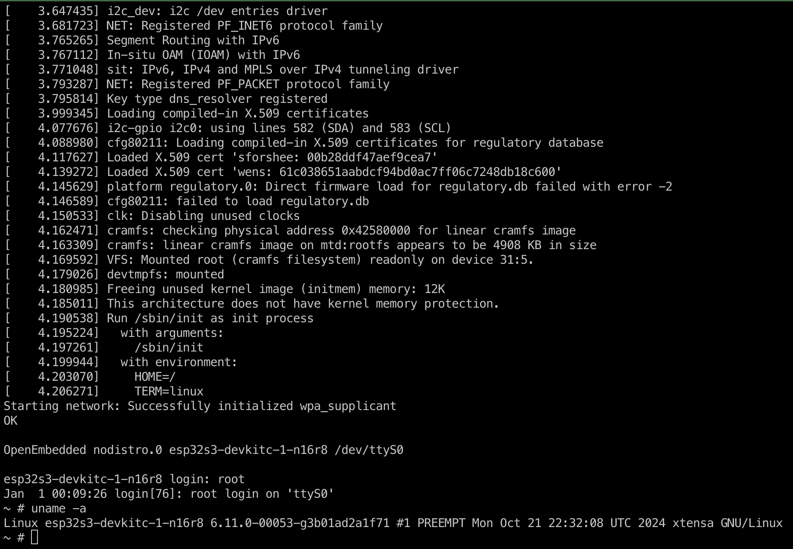

# ESP32-S3 Linux Yocto BSP

`meta-esp32s3-linux` is the Yocto Wrynose BSP for Linux on the Espressif
ESP32-S3 DevKitC-1 N16R8. Linux runs on core 1. ESP-Hosted firmware runs on
core 0 and provides the Linux Wi-Fi interface.

This is a no-MMU system. It is not a conventional embedded Linux target and
cannot use a stock Yocto SDK or arbitrary packages without porting work.

## Status And Supported Hardware

| Property | Value |
|---|---|
| Supported machine | `esp32s3-devkitc-1-n16r8` |
| Board memory | 16 MB flash, 8 MB PSRAM |
| CPU ABI | Xtensa `call0` FDPIC, no MMU |
| C library | uClibc-ng |
| Kernel image | Linux 6.11 `xipImage` |
| Root filesystem | XIP CramFS, read-only |
| Writable filesystems | JFFS2 at `/etc` and `/data` |
| Wi-Fi | ESP-Hosted, interface `espsta0` |
| Yocto release | Wrynose |

The included `esp32s3-devkitc-1-8m` machine configuration is incomplete: it
does not select `ESP32S3_PARTITION_TABLE_FILE`. Do not build or flash it as a
supported bundle without completing and testing its partition configuration.

## Architecture

The final flash bundle consists of separate artifacts rather than a disk image.

| Artifact | Purpose |
|---|---|
| ESP-Hosted bootloader and application | Starts core 0 and the Wi-Fi transport |
| `partition-table.bin` | Authoritative partition layout |
| `xipImage` | Linux kernel executed from flash |
| `rootfs.cramfs` | Read-only root filesystem |
| `etc.jffs2` | Initial writable `/etc` filesystem |
| `data.jffs2` | Initial writable `/data` filesystem |

`esp32s3-minimal-image` builds both `rootfs.cramfs` and `etc.jffs2`.
`etc.jffs2` is copied from the finalized package-built `/etc`, then the BSP's
ESP32-specific defaults are applied. Do not create a separate `/etc` image or
manually duplicate package-owned files such as `base-files`, `base-passwd`, or
BusyBox DHCP files.

The CramFS image must be generated by the layer's `mkcramfs -L -X`. A stock
`mkfs.cramfs` image may mount but crashes no-MMU userspace. Valid images have
CramFS flags `0x803`.

## Repository Layout

From the workspace root:

```text
yocto/
  build/                           # Local build state; generated
  meta-esp32s3-linux/              # This BSP layer
  poky/                            # Upstream Poky checkout
  meta-openembedded/               # Upstream dependency
```

Treat `yocto/poky`, `yocto/bitbake`, and `yocto/meta-openembedded` as upstream
source unless the task explicitly targets them. Never make persistent changes
under `yocto/build/tmp`; it is generated and may be removed by BitBake.

## Host Setup

Use a Linux host with a current POSIX shell, Git, Python 3, standard build
tools, and network access for source fetches. Build dependencies are managed
by Yocto recipes; no prebuilt Xtensa toolchain is required for the default
workflow.

Enter the Yocto environment before running BitBake. It selects the workspace
build directory and uses the system Python rather than pyenv shims:

```sh
source yocto/.env
bitbake -p
```

The first build downloads sources and builds the native tools and Xtensa
toolchain. It requires substantial disk space and can take significant time.
Keep the downloads and sstate cache between builds.

Run all following `bitbake` commands from this shell.

For interactive Yocto tools:

```sh
cd yocto
source .env
bitbake-layers show-layers
```

## Initial Configuration

The checked-in build configuration selects the supported N16R8 board. Confirm
these settings in `yocto/build/conf/local.conf` when creating a new build
directory:

```bitbake
MACHINE = "esp32s3-devkitc-1-n16r8"
TCMODE = "external-xtensa-esp32s3-fdpic"
```

Keep host-specific absolute paths in `yocto/build/conf/local.conf`, never in
the layer. The Xtensa compiler and binutils require `XTENSA_GNU_CONFIG` to
point at `esp32s3.so`; adding the compiler to `PATH` is insufficient. The
external toolchain recipe exports this setting into BitBake tasks.

The BSP requires these layers in `BBLAYERS`:

```text
poky/meta
meta-openembedded/meta-oe
meta-esp32s3-linux
```

The layer does not provide a conventional Yocto SDK. It masks unsupported
cross-Canadian SDK recipes because this target uses a custom no-MMU ABI.

## Build Workflow

Parse metadata before a build, especially after changing recipes or machine
configuration:

```sh
bitbake -p
```

Build focused targets during development:

```sh
bitbake virtual/kernel
bitbake esp-hosted-firmware
bitbake esp32s3-minimal-image
```

Build the complete, flashable artifact set when changing image contents,
partitions, deploy contracts, kernel, or firmware:

```sh
bitbake esp32s3-flash-bundle
```

The bundle target builds its dependencies and gathers the final outputs at:

```text
yocto/build/tmp/deploy/images/esp32s3-devkitc-1-n16r8/
  esp32s3-devkitc-1-n16r8-flash-bundle/
```

The bundle directory contains:

```text
bootloader.bin
network_adapter.bin
partition-table.bin
flasher_args.json
xipImage
rootfs.cramfs
etc.jffs2
data.jffs2
flash-esp32s3-linux.py
flash-esp32s3-linux_rfc.py
```

`flasher_args.json` is authoritative for ESP-IDF firmware files and offsets.
`partition-table.bin` is authoritative for Linux partitions and capacities.
Do not duplicate offsets in scripts, documentation, or manual `esptool`
commands.

## Package Development

Add target packages to `IMAGE_INSTALL` in
`recipes-core/images/esp32s3-minimal-image.bb`, then build the image and
bundle. Package changes affect both the read-only root and generated
`etc.jffs2` if the package installs files under `/etc`.

The target is no-MMU. Packages which require `fork()`, an MMU, shared-library
loading behavior unavailable to FDPIC, or a full desktop-style process model
may fail to configure, compile, or run. Port packages in the BSP layer with
an Xtensa-specific `.bbappend` and a documented patch. Validate the narrowest
recipe first:

```sh
bitbake <recipe>
bitbake esp32s3-minimal-image
bitbake esp32s3-flash-bundle
```

Do not add software by modifying a generated rootfs under `yocto/build/tmp`.

## Flashing

Flashing erases and writes a connected device. Build the current bundle and
verify the intended serial port and board before running a flashing command.

### Direct USB Serial

Install the Python `esptool` command on the host:

```sh
python3 -m pip install --user esptool
```

Flash a complete bundle through a local serial device:

```sh
python3 yocto/build/tmp/deploy/images/esp32s3-devkitc-1-n16r8/\
esp32s3-devkitc-1-n16r8-flash-bundle/flash-esp32s3-linux.py \
  --port /dev/ttyUSB0 \
  --bundle yocto/build/tmp/deploy/images/esp32s3-devkitc-1-n16r8/\
esp32s3-devkitc-1-n16r8-flash-bundle
```

Typical macOS device names are `/dev/tty.usbserial-*` and
`/dev/cu.usbmodem*`.

### RFC2217 Workspace Board

The workspace wrapper defaults to the local RFC2217 endpoint at
`rfc2217://127.0.0.1:14001?ign_set_control`. It requires ESP-IDF 5.5 because
the RFC2217 helper uses `esptool.py` from the ESP-IDF environment:

```sh
bitbake esp32s3-flash-bundle
./yocto/flash-esp32s3-linux.sh
```

Override the endpoint, bundle, or ESP-IDF export script when necessary:

```sh
PORT='rfc2217://host.example:14001?ign_set_control' \
BUNDLE=/absolute/path/to/esp32s3-devkitc-1-n16r8-flash-bundle \
IDF_EXPORT="$HOME/esp/v5.5/esp-idf/export.sh" \
./yocto/flash-esp32s3-linux.sh
```

### Preserving Writable Data

By default, both helpers flash `etc.jffs2` and `data.jffs2`.

Use `--preserve-data` only when the existing `/data` layout and contents remain
compatible. Use `--preserve-etc` only when the existing `/etc` layout and
contents remain compatible. Reflash `etc.jffs2` after changes to account
files, mount policy, installed `/etc` files, or `/etc` image generation.

The helpers verify every image against the generated partition table before
writing. `etc.jffs2` is padded to its complete partition so a smaller update
cannot leave stale JFFS2 nodes behind.

## First Boot And Validation

Open the serial console at 115200 baud. The expected initial login is:

```text
login: root
password: press Enter
```

The empty root password is for bring-up only. Set an authentication policy
before enabling a network-facing login service or exposing the board to an
untrusted network.

A successful boot reaches the OpenEmbedded login prompt and includes the
pinned kernel revision, ESP-Hosted detection, seven MTD partitions, a linear
CramFS mount, and `/sbin/init`. Treat a kernel panic, CramFS error, missing
ESP-Hosted detection, or no login prompt as a failed validation.



Verify writable storage after boot:

```sh
mount
touch /etc/.write-test && rm /etc/.write-test
touch /data/.write-test && rm /data/.write-test
```

For the workspace board, capture boot output non-interactively from the
ESP-Hosted network-adapter project directory:

```sh
cd esp32-linux-build/build/esp-hosted/esp_hosted_ng/esp/esp_driver/network_adapter
source ~/esp/v5.5/esp-idf/export.sh >/dev/null
timeout 30s script -q -c \
  'idf.py --port "rfc2217://127.0.0.1:14001?ign_set_control" --baud 115200 monitor' \
  /dev/null
```

`idf.py monitor` uses that directory to locate the firmware ELF files. A
timeout exit is expected after the requested capture duration.

## Wi-Fi

The base image includes `wpa_supplicant`, `iw`, the wireless regulatory
database, and the BusyBox DHCP client. Wi-Fi starts through
`/etc/init.d/S40network` once credentials are enabled.

Configure the persistent `/etc/wpa_supplicant.conf` on the target:

```text
network={
    ssid="YOUR_SSID"
    psk="YOUR_PASSPHRASE"
    disabled=0
}
```

Apply and verify the configuration:

```sh
/etc/init.d/S40network restart
iw dev espsta0 link
ip addr show espsta0
```

The passphrase is stored in writable `/etc`. Restrict physical and serial
access, or generate a PSK with `wpa_passphrase` on a development host instead
of keeping the plaintext passphrase.

## Common Tasks

| Task | Command |
|---|---|
| Parse all metadata | `bitbake -p` |
| Build kernel | `bitbake virtual/kernel` |
| Build root and `/etc` | `bitbake esp32s3-minimal-image` |
| Build Wi-Fi firmware deploy artifacts | `bitbake esp-hosted-firmware` |
| Build complete bundle | `bitbake esp32s3-flash-bundle` |
| Validate flash helper syntax | `python3 -m py_compile yocto/meta-esp32s3-linux/recipes-bsp/esp32s3-flash/files/flash-esp32s3-linux.py yocto/meta-esp32s3-linux/recipes-bsp/esp32s3-flash/files/flash-esp32s3-linux_rfc.py` |
| Inspect task environment | `bitbake -e <recipe>` |
| Clean one recipe's work directory | `bitbake -c clean <recipe>` |
| Force one task | `bitbake -f -c <task> <recipe>` |

Use `clean` sparingly. Do not delete `yocto/build/tmp` while another BitBake
process is active.

## Troubleshooting

### Xtensa tools fail to execute

Confirm `XTENSA_GNU_CONFIG` points to the toolchain's `esp32s3.so`. The
compiler being present on `PATH` alone is not sufficient.

### Image boots but userspace crashes

Confirm the CramFS image came from the layer's `mkcramfs -L -X` invocation.
Stock CramFS tooling creates an image incompatible with this no-MMU userspace.

### A new package fails on `fork()`

This is expected for unported no-MMU software. Check whether an upstream
no-MMU or `vfork()` path exists. Add a narrowly scoped BSP patch only after
validating the recipe build. Do not suppress compilation errors globally.

### Flash helper rejects an artifact

Rebuild `esp32s3-flash-bundle`. The helper reads the generated partition table
and rejects missing or oversized artifacts. Do not bypass these checks or use
copied offsets.

### The board has no network after boot

Check the serial log for ESP-Hosted detection, then verify the `espsta0`
interface, `wpa_supplicant.conf`, association state, and DHCP lease in that
order.

## Contribution Rules

- Keep BSP changes in `meta-esp32s3-linux`; do not patch upstream layers for
  target-specific behavior.
- Keep generated files out of commits, including `yocto/build/tmp`.
- Use immutable source revisions and checksums in recipes.
- Build the narrowest affected target, then the complete flash bundle when
  artifact contracts or image contents change.
- Hardware validation is required for boot/login, writable `/etc` and `/data`,
  Wi-Fi association, and DHCP. Retain the serial log and exact flashed bundle.
- Do not flash a connected board without explicit approval from its owner.
